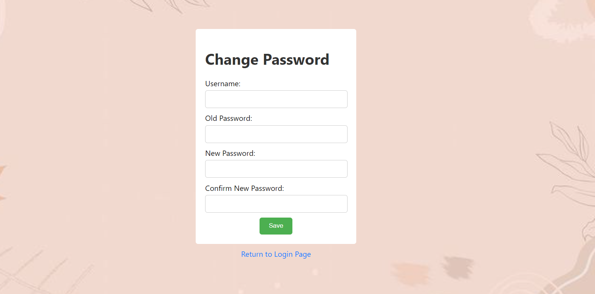
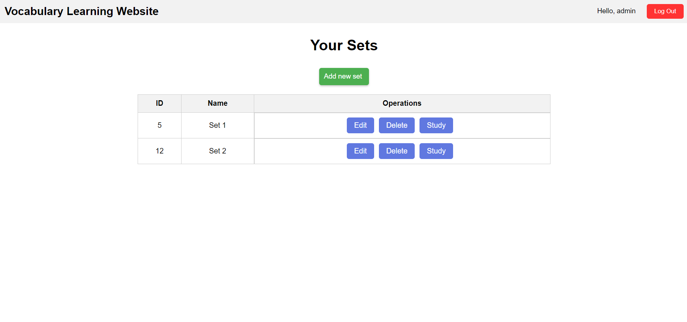
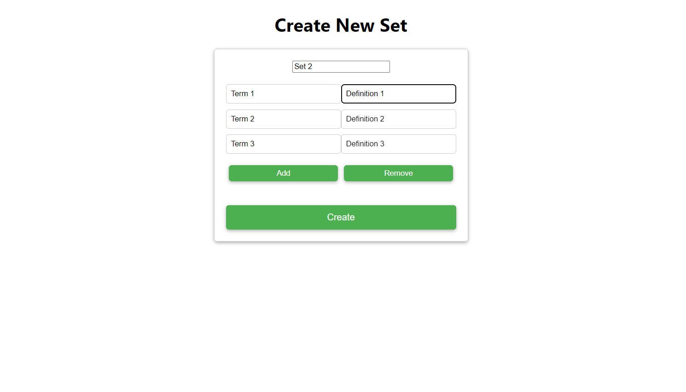
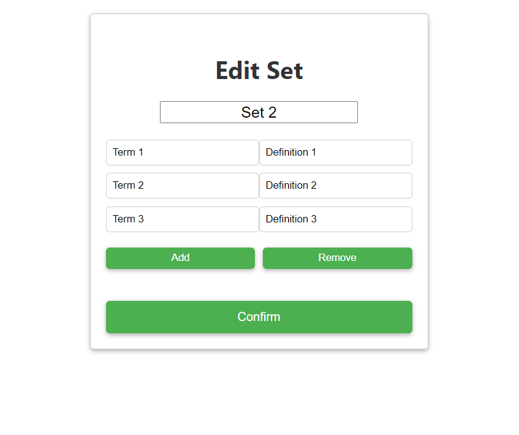
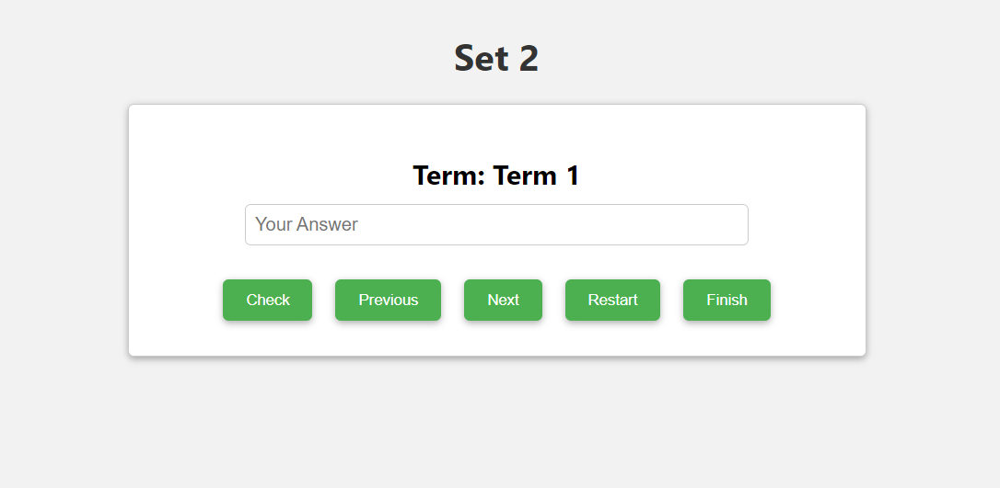

# 1. Giới thiệu chung
- Sản phẩm này là một website dùng để học từ vựng tương tự như quizlet.
- Các chức năng chính:
  + Đăng nhập, đăng ký: cho phép nhiều người dùng sử dụng trang web
  + Tạo các tập hợp thẻ để học từ vựng cũng như chỉnh sửa chúng
  + Chức năng học để luyện nhớ từ vựng

# 2. Bối cảnh làm sản phẩm
- Sản phẩm này được tạo ra với mục đích chính là luyện tập JSP và Java Servlet.
- Lý do chọn đề tài là website học từ vựng: một trang web học từ vựng là khá đơn giản và chưa có nhiều tính năng phức tạp, phù hợp cho level nhập môn như em
- Thời gian làm: 10 ngày (thời gian BT chương trình học bổng)
- Vai trò trong sản phẩm: đây là dự án cá nhân của bản thân em

# 3. Các chức năng của sản phẩm
- Đăng nhập: 
- Đăng ký
- Đổi mật khẩu
- Thêm tập hợp các thẻ học mới
- Chỉnh sửa các thẻ
- Xóa các thẻ
- Luyện tập từ vựng với các thẻ

# 4. Công nghệ sử dụng
- JSP
- Java Servlet
- Tomcat
- MySQL, JDBC
- HTML, CSS, JavaScipt (nhúng trong file JSP)

# 5. Cách chạy chương trình
- Tải về IDE IntelliJ Ultimate bản 2023, MySQL Workbench, Tomcat 10.1.11
- Tạo CSDL theo code trong file SQL
- Giải nén code và thêm vào trong IntelliJ, chỉnh cấu hình Tomcat
- Vào file web.xml, chỉnh sửa các biến DBurl, user, password
- Bắt đầu chạy chương trình bằng nút Run

# 6. Demo chương trình
- Đầu tiên, khi truy cập vào đường dẫn http://localhost:8080/VocabLearningWebsite/ thì chương trình sẽ hiển thị trang bìa với nút Login trên đó. Bấm vào nút Login sẽ chuyển đến trang đăng nhập

- Tiếp đến là trang đăng nhập. Trang đăng nhập có 2 nút phụ là Create New Acount và Change Password để tạo tài khoản mới cũng như đổi mật khẩu.

  - Trang tạo tài khoản mới có các trường dữ liệu là tên đăng nhập, mật khẩu và xác nhận mật khẩu. Nếu đăng ký tên đăng nhập đã tồn tại hoặc mật khẩu và phần xác nhận mật khẩu không trùng nhau hệ thống sẽ báo lỗi. Ngược lại thì tạo tài khoản và đưa ra thông báo tạo thành công.

  - Trang đổi mật khẩu có các trường tài khoản, mật khẩu, mật khẩu mới và xác nhận mật khẩu mới. Nếu tài khoản và mật khẩu không tồn tại trong cơ sở dữ liệu hoặc mật khẩu mới khác phần xác nhận thì hệ thống sẽ báo lỗi. Ngược lại thì hệ thống cập nhận mật khẩu mới và đưa ra thông báo cho người dùng.

- Khi nhập vào tài khoản không đúng với trong cơ sở dữ liệu thì trang web sẽ báo lỗi. 

- Ngược lại thì sẽ chuyển đến trang chủ của hệ thống. Trang chủ hiển thị các set của người dùng, nút đăng xuất và các nút thao tác như thêm mới, sửa, xóa và học.

  - Nút đăng xuất: thoát tài khoản hiện tại ra và trở về trang đăng nhập
  - Phần tạo mới: hệ thống hiển thị trường tiêu dề, từ và định nghĩa. Các nút add và remove sẽ thêm và xóa cặp từ ở dưới cùng, tối thiểu luôn có 1 cặp hiển thị. Sau khi bấm tạo mới thì hệ thống sẽ thêm set vừa tạo vào trong cơ sở dữ liệu.
    
  - Phần chỉnh sửa: đọc nội dung set lên để người dùng chỉnh sửa và lưu lại. Giao diện tương tự phần tạo mới
     
  - Nút xóa: khi bấm vào thì sẽ xóa set tương ứng khỏi cơ sở dữ liệu
  - Nút học: hiển thị tiêu đề, từ và để định nghĩa do người dùng nhập vào. Khi người dùng bấm nút check hoặc enter thì hệ thống hiển thị thông báo đúng sai và chuyển sang câu tiếp theo, nút next và previous để chuyển sang câu tiếp theo và trước đó, nút restart để bắt đầu lại và nút finish để hoàn thành và quay lại trang chủ
    

# 7. Lưu ý
Code nằm ở branch master, anh/chị/thầy/cô xem bên đó giúp em ạ.  
Chương trình này được viết trong thời gian ngắn và em cũng mới học JSP/Servlet trong thời gian làm bài tập học bổng nên giao diện và chức năng vẫn còn sơ sài. Nếu được em rất mong nhận được góp ý của các anh/chị/thầy/cô để phát triển cũng như trau dồi thêm kỹ năng của mình. Anh/chị/thầy/cô nếu được hãy góp ý cho em qua email 21012326@st.phenikaa-uni.edu.vn ạ. Em xin chân thành cảm ơn!
